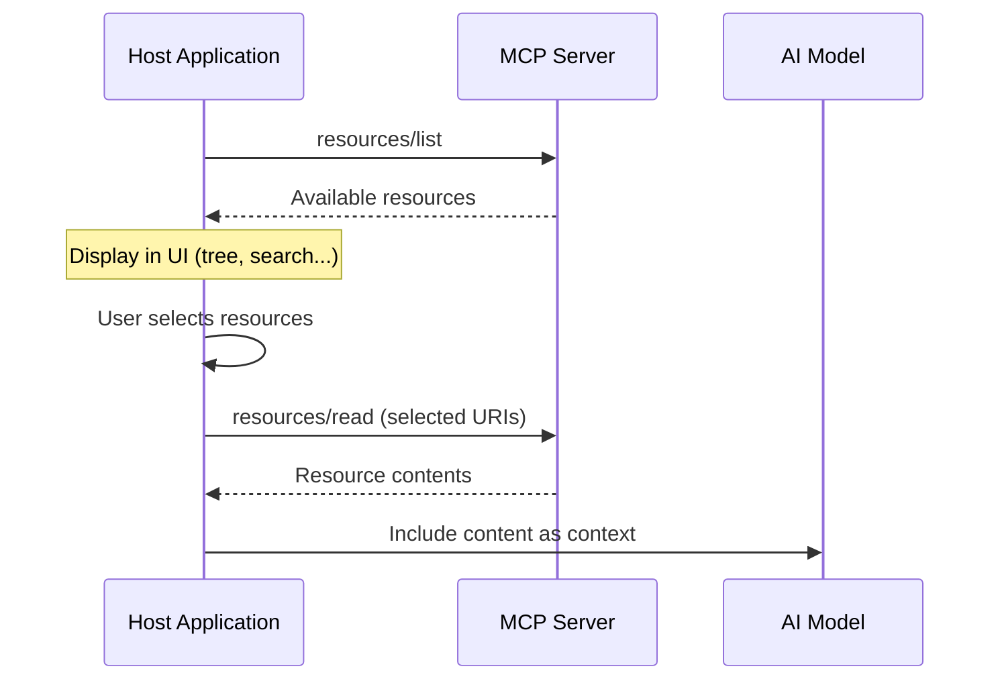

## 什么是资源？

资源是 MCP 服务器向客户端公开**只读数据**的一种标准化方式。它们提供上下文信息，帮助 AI 模型理解您的应用程序，例如文件、数据库架构、配置或任何可通过 URI 访问的数据。

::code-collapse

```txt [Prompt]
使用 @nuxtjs/mcp-toolkit 在我的 Nuxt 应用中创建一个新的 MCP 资源。

- 在 server/mcp/resources/ 中创建一个文件（例如 server/mcp/resources/readme.ts）
- 使用 defineMcpResource（自动导入）并附带描述
- 对于本地文件，使用 file 属性：file: 'README.md'（URI、MIME 类型和处理器将自动生成）
- 对于自定义数据，手动定义 uri 和 handler，返回 { contents: [{ uri, text, mimeType }] }
- 对于动态资源，使用 @modelcontextprotocol/sdk/server/mcp.js 中的 ResourceTemplate 配合 URI 变量
- 名称和标题将根据文件名自动生成
- 使用子目录自动推断分组（例如 resources/config/app.ts → group: 'config'）

文档：https://mcp-toolkit.nuxt.dev/core-concepts/resources
```

::

::callout{icon="i-lucide-lightbulb" color="primary"}
**核心概念**：与由 AI 直接调用以执行操作的[工具](/core-concepts/tools)不同，资源是**由应用程序驱动的**。宿主应用程序（而非 AI）决定何时以及如何获取资源内容并将其包含在对话中。
::

每个资源都由一个唯一的 URI 标识（例如 `file:///project/README.md` 或 `api://users/123`）。

## 资源与工具

理解资源与工具之间的区别至关重要：

| 方面 | 资源 | 工具 |
|--------|-----------|-------|
| **目的** | 提供上下文和数据 | 执行操作 |
| **调用方式** | 应用程序驱动（用户或应用选择） | AI 驱动（模型决定调用） |
| **性质** | 只读数据访问 | 可读取和修改状态 |
| **控制权** | 用户/应用程序控制包含的内容 | AI 决定何时使用 |
| **示例** | 文件、配置、数据库架构、日志 | 发送邮件、创建文件、查询 API |

**何时使用资源：**
- 公开项目文件或文档
- 共享数据库架构或配置
- 提供日志或系统信息作为上下文

**何时使用工具：**
- 执行修改状态的操作
- 执行应由 AI 决定触发的操作
- 与外部 API 或服务交互

## 资源的使用方式

资源遵循**应用程序驱动**模型。典型流程如下：



1. **发现**：应用程序调用 `resources/list` 来发现可用资源
2. **选择**：应用程序在 UI 中显示资源（树状视图、搜索、列表），用户或应用程序逻辑选择要包含哪些资源
3. **读取**：应用程序通过 `resources/read` 获取选定的资源
4. **上下文包含**：应用程序将资源内容作为上下文包含在 AI 对话中

::callout{icon="i-lucide-info" color="info"}
AI 模型永远不会直接请求资源。始终由应用程序根据用户选择、启发式规则或自动上下文检测来决定包含哪些资源。
::

## 静态资源

静态资源具有固定不变的 URI。

### 简单文件资源

公开本地文件最简单的方法是使用 `file` 属性。这将自动处理 URI 生成、MIME 类型检测和文件读取。

```typescript [server/mcp/resources/readme.ts]
import { defineMcpResource } from '@nuxtjs/mcp-toolkit/server'

export default defineMcpResource({
  name: 'readme',
  description: 'Project README file',
  file: 'README.md', // 相对于项目根目录
})
```

这将生成：
- **URI**：`file:///path/to/project/README.md`
- **处理器**：自动读取文件内容
- **MIME 类型**：自动检测（例如 `text/markdown`）

### 自定义静态资源

为了获得更高的控制权，您可以手动定义 `uri` 和 `handler`：

```typescript [server/mcp/resources/custom-readme.ts]
import { readFile } from 'node:fs/promises'
import { fileURLToPath } from 'node:url'
import { defineMcpResource } from '@nuxtjs/mcp-toolkit/server'

export default defineMcpResource({
  name: 'custom-readme',
  title: 'README',
  description: 'Project README file',
  uri: 'file:///README.md',
  metadata: {
    mimeType: 'text/markdown',
  },
  handler: async (uri: URL) => {
    const filePath = fileURLToPath(uri)
    const content = await readFile(filePath, 'utf-8')
    return {
      contents: [{
        uri: uri.toString(),
        mimeType: 'text/markdown',
        text: content,
      }],
    }
  },
})
```

## 自动生成的名称和标题

您可以省略 `name` 和 `title` —— 它们将根据文件名自动生成：

```typescript [server/mcp/resources/project-readme.ts]
import { defineMcpResource } from '@nuxtjs/mcp-toolkit/server'

export default defineMcpResource({
  // name 和 title 将根据文件名自动生成：
  // name: 'project-readme'
  // title: 'Project Readme'
  file: 'README.md'
})
```

文件名 `project-readme.ts` 将自动转换为：
- `name`：`project-readme`（短横线命名法）
- `title`：`Project Readme`（标题大小写）

您仍然可以显式提供 `name` 或 `title` 以覆盖自动生成的值。

## 资源结构

资源定义包含以下内容：

::code-group

```typescript [File Resource]
import { defineMcpResource } from '@nuxtjs/mcp-toolkit/server'

export default defineMcpResource({
  name: 'resource-name',
  file: 'path/to/file.txt', // 本地文件路径
  metadata: { ... }
})
```

```typescript [Custom Resource]
import { defineMcpResource } from '@nuxtjs/mcp-toolkit/server'

export default defineMcpResource({
  name: 'resource-name',  // 唯一标识符
  uri: 'uri://...',      // 静态 URI 或 ResourceTemplate
  handler: async (uri) => { // 处理器函数
    return { contents: [...] }
  },
})
```

::

## 使用模板的动态资源

使用 `ResourceTemplate` 创建接受变量的动态资源：

```typescript [server/mcp/resources/file.ts]
import { readFile } from 'node:fs/promises'
import { join } from 'node:path'
import { ResourceTemplate } from '@modelcontextprotocol/sdk/server/mcp.js'
import type { Variables } from '@modelcontextprotocol/sdk/shared/uriTemplate.js'
import { defineMcpResource } from '@nuxtjs/mcp-toolkit/server'

export default defineMcpResource({
  name: 'file',
  title: 'File Resource',
  uri: new ResourceTemplate('file:///project/{+path}', {
    list: async () => {
      // 返回可用资源列表
      return {
        resources: [
          { uri: 'file:///project/README.md', name: 'README.md' },
          { uri: 'file:///project/src/index.ts', name: 'src/index.ts' },
        ],
      }
    },
  }),
  handler: async (uri: URL, variables: Variables) => {
    const path = variables.path as string
    const filePath = join(process.cwd(), path)
    const content = await readFile(filePath, 'utf-8')

    return {
      contents: [{
        uri: uri.toString(),
        mimeType: 'text/plain',
        text: content,
      }],
    }
  },
})
```

## ResourceTemplate

`ResourceTemplate` 允许您在 URI 中创建包含可变部分的资源：

```typescript
new ResourceTemplate('file:///project/{+path}', {
  list: async () => {
    // 可选：返回可用资源列表
    return {
      resources: [
        { uri: 'file:///project/file1.txt', name: 'File 1' },
        { uri: 'file:///project/file2.txt', name: 'File 2' },
      ],
    }
  },
})
```

### 模板变量

URI 中的变量使用 `{variableName}` 定义：

```typescript
// 单个变量
new ResourceTemplate('file:///project/{path}', { ... })

// 允许包含斜杠的变量（保留扩展）
new ResourceTemplate('file:///project/{+path}', { ... })

// 多个变量
new ResourceTemplate('api://users/{userId}/posts/{postId}', { ... })
```

## 处理器函数

处理器接收解析后的 URI 和可选的变量：

```typescript
// 静态资源处理器
handler: async (uri: URL) => {
  return {
    contents: [{
      uri: uri.toString(),
      mimeType: 'text/plain',
      text: 'Content',
    }],
  }
}

// 动态资源处理器
handler: async (uri: URL, variables: Variables) => {
  const path = variables.path as string
  // 使用变量来解析资源
  return {
    contents: [{
      uri: uri.toString(),
      mimeType: 'text/plain',
      text: 'Content',
    }],
  }
}
```

## 资源元数据

添加元数据以帮助客户端理解资源：

```typescript [server/mcp/resources/readme.ts]
import { defineMcpResource } from '@nuxtjs/mcp-toolkit/server'

export default defineMcpResource({
  name: 'readme',
  description: 'Project README file',
  file: 'README.md',
})
```

## 内容类型

资源可以返回不同的 MIME 类型：

::code-group

```typescript [Text/Markdown]
return {
  contents: [{
    uri: uri.toString(),
    mimeType: 'text/markdown',
    text: '# Markdown content',
  }],
}
```

```typescript [JSON]
return {
  contents: [{
    uri: uri.toString(),
    mimeType: 'application/json',
    text: JSON.stringify({ key: 'value' }),
  }],
}
```

```typescript [Binary Data]
return {
  contents: [{
    uri: uri.toString(),
    mimeType: 'image/png',
    blob: Buffer.from(binaryData),
  }],
}
```

::

## 错误处理

在处理器中优雅地处理错误：

```typescript [server/mcp/resources/custom-readme.ts]
import { readFile } from 'node:fs/promises'
import { fileURLToPath } from 'node:url'
import { defineMcpResource } from '@nuxtjs/mcp-toolkit/server'

export default defineMcpResource({
  name: 'readme',
  uri: 'file:///README.md',
  handler: async (uri: URL) => {
    try {
      const filePath = fileURLToPath(uri)
      const content = await readFile(filePath, 'utf-8')

      return {
        contents: [{
          uri: uri.toString(),
          mimeType: 'text/markdown',
          text: content,
        }],
      }
    }
    catch (error) {
      return {
        contents: [{
          uri: uri.toString(),
          mimeType: 'text/plain',
          text: `Error: ${error instanceof Error ? error.message : String(error)}`,
        }],
        isError: true,
      }
    }
  },
})
```

## 分组与标签

使用 `group` 和 `tags` 对资源进行分类组织。这些字段的用法与 [工具](/core-concepts/tools#groups-and-tags) 中的完全相同。

```typescript [server/mcp/resources/config/app-settings.ts]
import { defineMcpResource } from '@nuxtjs/mcp-toolkit/server'

export default defineMcpResource({
  group: 'config',
  tags: ['readonly', 'settings'],
  description: 'Application settings',
  file: 'config/app.json',
})
```

你也可以将资源文件放在子目录中，以自动推断分组：

```
server/mcp/resources/
├── config/
│   └── app-settings.ts   → 分组: 'config'
├── docs/
│   └── readme.ts         → 分组: 'docs'
└── schema.ts             → 无分组
```

::callout{icon="i-lucide-info" color="info"}
资源的 `group` 和 `tags` 会存储在定义对象中，但尚未包含在 `resources/list` 协议响应中。当 MCP SDK 采纳 [SEP-1300](https://github.com/modelcontextprotocol/modelcontextprotocol/issues/1300) 后，将支持此功能。
::

## 文件组织

将你的资源组织在 `server/mcp/resources/` 目录中。支持扁平化和嵌套式布局：

```
server/
└── mcp/
    └── resources/
        ├── readme.ts
        ├── file.ts
        └── config/
            └── app-settings.ts
```

每个文件都应导出一个默认的资源定义。子目录会自动设置 `group`。

## URI 方案

你可以根据用例使用任何合理的 URI 方案：

- `file://` - 文件系统资源
- `api://` - API 端点
- `http://` / `https://` - Web 资源
- `custom://` - 自定义方案

## 条件注册

你可以使用 `enabled` 守卫来控制资源是否对客户端可见：

```typescript [server/mcp/resources/internal-data.ts]
export default defineMcpResource({
  name: 'internal-data',
  uri: 'app://internal',
  enabled: event => event.context.user?.role === 'admin',
  handler: async (uri) => ({
    contents: [{ uri: uri.toString(), text: 'Internal data...' }],
  }),
})
```

::callout{icon="i-lucide-book-open" color="primary"}
有关基于身份验证进行过滤的详细文档，请参阅 [动态定义](/advanced/dynamic-definitions) 指南。
::

## 下一步

- [工具](/core-concepts/tools) - 创建用于执行操作的工具
- [提示词](/core-concepts/prompts) - 创建可复用的提示词
- [处理器](/core-concepts/handlers) - 创建自定义 MCP 端点
- [动态定义](/advanced/dynamic-definitions) - 条件化注册定义
- [示例](/examples/file-operations) - 更多资源示例
